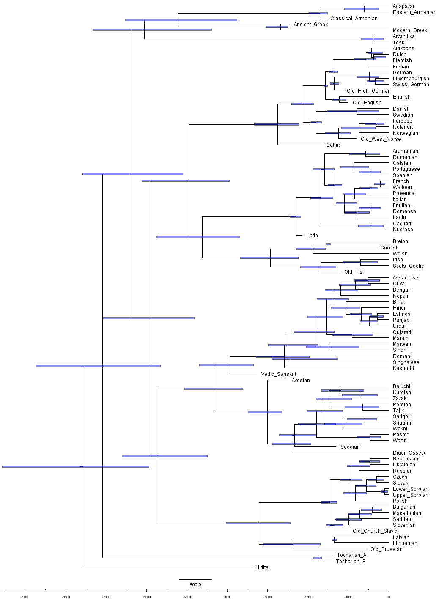
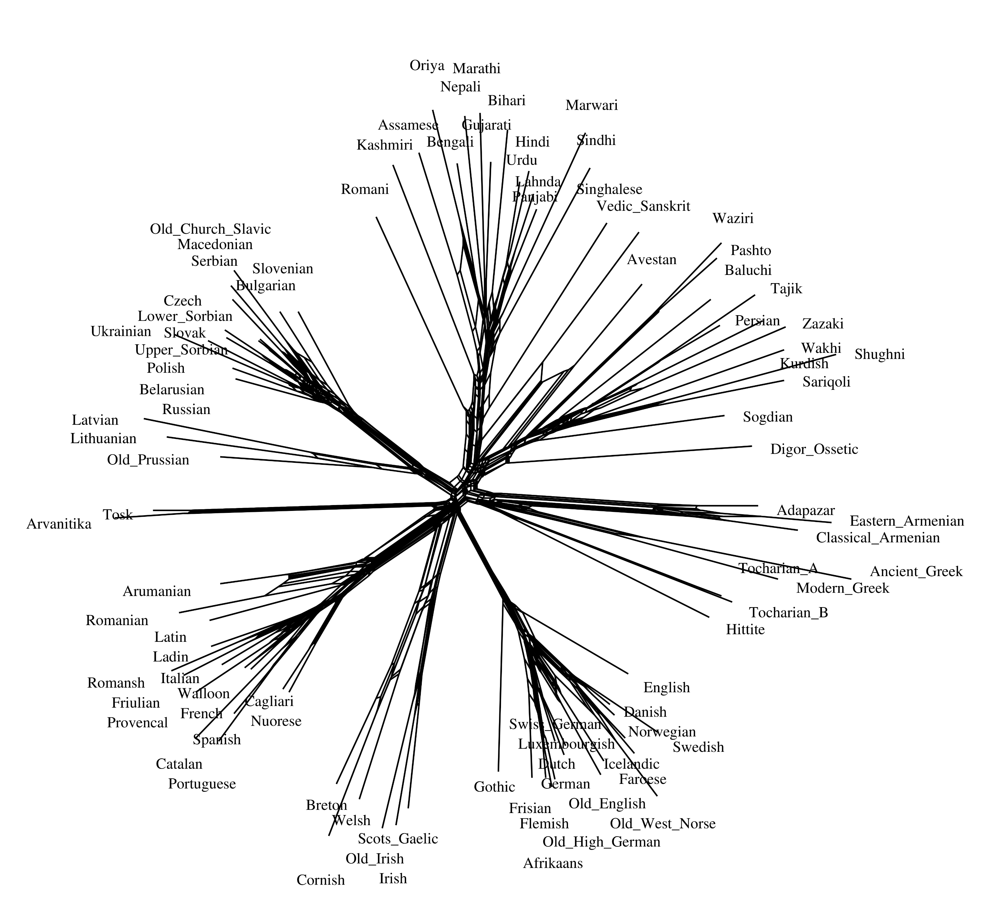

# Indo-European Lexical Cognacy Database (IELex) and ‘Good Enough’ Tree

[](https://doi.org/10.5281/zenodo.5556801)

This repository contains data and scripts for producing a Baysian phylogenetic tree sample of for the Indo-European family which is *good enough* for use in phylogenetic comparative methods. It should be considered as the current version of the "Indo-European Lexical Cognacy Database" from Dunn et al. (2011), popularly known as "IELex". The "Indo-European Cognate Relationships" (IE-CoR) database project, now based at the Max Planck Institute for Evolutionary Anthropology, has been working on a much improved database originally based on this data, but has not had any public data release so far. In the meantime, this is the best we can offer, as an alternative to the original website (http://ielex.mpi.nl) which is now offline.

## Design principles

- The cognate coding is borrowed from Andrew Garrett's corrections of the IELex database (published in supplementary materials to Chang et al. 2015).
- Generated with standard BEAST2, without further customisation (Bouckaert et al., 2019). This means we cannot use the Chang et al 2015 notion of ancestry constraints (and there are theoretical and empirical reasons that make these controversial in any case).
- Ultimately we will offer control files generated using the beastling package (Maurits et al. 2017), which would make it very easy for users to change data and model settings; unfortunately we have found some bugs in the current iteration of beastling which makes it unsuitable. 

## The "Broad data set"

- Use the Bouckaert et al. (2012) language sample minus sparsely attested languages, following Chang et al. (2015). This is a tradeoff between quality of the wordlist and quantity of languages in the sample. 
- Slightly truncated meaning list:

    The broad data set consists of ninety-four languages and 197 meaning
    classes.  Of the 207 meaning classes in IELEX, three (‘blow’, ‘father’,
    ‘mother’) were excluded as being especially susceptible to sound symbolism,
    and seven others were excluded because they were unattested in more than
    30% of the languages, probably due to the fact that they are not in the
    Dyen data set, which was constructed around the 200 items proposed by
    Swadesh (1952).  (Chang et al 2015:213)

  Dropped meanings are: "blow", "breast", "father", "fingernail", "full", "horn", "knee",
    "moon", "mother", "round".

- Please note that the broad data file only includes information on cognancy, without the
form or any phonological transcription of the lexemes.

## Calibrations

Calibrations are derived from Chang et al. (2015) for individual languages (but 0-50 year calibrations on the modern languages are *not* included) and Bouckaert et al. (2012) for the family level calibrations. These are listed in `beastling`-compatible format ("X - Y" indicates a uniform distribution between X and Y; for `normal` and `rlognormal` the first parameter is the mean and second parameter is standard deviation).

| Language/Clade       | Calibration                    | Source                  |
|----------------------|--------------------------------|-------------------------|
| Ancient Greek        | 2400-2500                      | Chang et al. (2015)     |
| Avestan              | 2450-2550                      | Chang et al. (2015)     |
| Balto Slavic         | normal(3100.0, 600.0)[^1]      | Bouckaert et al. (2012) |
| Celtic               | 1200 + rlognormal(2000.0, 0.6) | Bouckaert et al. (2012) |
| Classical Armenian   | 1500-1600                      | Chang et al. (2015)     |
| Cornish              | 200-400                        | Chang et al. (2015)     |
| French Iberian       | normal(1400.0, 100.0)          | Bouckaert et al. (2012) |
| Gothic               | 1625-1675                      | Chang et al. (2015)     |
| Greek split          | > 2500.0                       | Bouckaert et al. (2012) |
| Hittite              | 3300-3500                      | Chang et al. (2015)     |
| Indic                | 2150 + rlognormal(1000.0, 1.0) | Bouckaert et al. (2012) |
| Indo-Iranian         | 3000-10000                     | Bouckaert et al. (2012) |
| Iranian              | 2600 + rlognormal(400.0, 0.8)  | Bouckaert et al. (2012) |
| Latin                | 2100-2200                      | Chang et al. (2015)     |
| Latin Romance        | normal(2000.0, 135.0)          | Bouckaert et al. (2012) |
| Latvian, Lithuanian  | normal(1350.0, 25.0)           | Bouckaert et al. (2012) |
| Northwest Germanic   | normal(1875.0, 67.0)           | Bouckaert et al. (2012) |
| Old Church Slavic    | 950-1050                       | Chang et al. (2015)     |
| Old English          | 900-1050                       | Chang et al. (2015)     |
| Old High German      | 1100-1200                      | Chang et al. (2015)     |
| Old Irish            | 1100-1300                      | Chang et al. (2015)     |
| Old Prussian         | 500-600                        | Chang et al. (2015)     |
| Old West Norse       | 750-850                        | Chang et al. (2015)     |
| Slavic               | 1200 + rlognormal(300.0, 0.6)  | Bouckaert et al. (2012) |
| Sogdian              | 1200-1400                      | Chang et al. (2015)     |
| Tocharian A          | 1200-1500                      | Chang et al. (2015)     |
| Tocharian B          | 1200-1500                      | Chang et al. (2015)     |
| Tocharic             | 1650 + rlognormal(200.0, 0.9)  | Bouckaert et al. (2012) |
| Vedic Sanskrit       | 3000-3500                      | Chang et al. (2015)     |
| West Germanic        | normal(1550.0, 25.0)           | Bouckaert et al. (2012) |
| originate(Brythonic) | normal(1500.0, 25.0)           | Bouckaert et al. (2012) |

[^1]:  Note that, as per source, Balto_Slavic distribution should be truncated from 2000-3400. This is not done in the model we are presenting here.

## Tree samples

### IE-trees-v1

The control file IE-trees-v1/ie-v1.xml was made manually by Tiago Tresoldi, following as close as possible the model generated by `beastling`. The model was built in BEAUTi, following the parameters of the original beastling configuration. We use a Binary Covarion model for a coalescent tree with constant population. Missing data is encoded as `?`; we only used concepts that had at least 90% coverage across the doculects. Concepts were divided in four different partitions, each with its individual site model, with each partition holding roughly the same number of concepts each and concept divided by the cardinality of their corresponding sets of individual cognate sets (25%, 50%, 75%, and 100% percentiles). We used a chain length of 10^8 and a burn-in of 50%. The tree includes multimonophyletic constraints, as given in the corresponding Newick tree, and date calibrations for both tips and splits as given above.

## Files

The `data/` directory holds the files most researchers will be interested in:

  - `ielex.csv` is a single table in long format containing the essential database information,
    given one entry per row, each with the associated language, concept, and cognate set.
    It also carries the glottocode (Hammarström et al., 2021) corresponding to each language;
    concept glosses are given via the corresponding Concepticon (List et al., 2021) cognate set.
    It is the file most people will want when searching for "IELex data".
    
  - `concepts.csv` is a list mapping all concepts used in IELex to their corresponding
    concept set in Concepticon (List et al., 2021), giving both the gloss and the id.

  - `ielex.nex` is a NEXUS file with the information from the table above, with ascertainment correction columns, charstate labels, and assumptions. The file is built with `build/build_nexus.py`.
    
  - `ielex.nn.pdf` and `ielex.nn.png` are a PDF and a high-resolution PNG from the NEXUS
    file above, generated with SplitsTree (Huson & Bryant, 2006).

  - `ielex.mcc.tre` is the Maximum Clade Credibility ("consensus") tree from our latest
    analysis (currently `IE-tree-v1`). The first 50% of the sample was removed as burn-in.

  - `ielex.mcc.pdf` is a graphic rendering of the tree above, generated with FigTree.
  
The `build/` directory holds the files used for preparing the phylogenetic reconstruction.

The `IE-trees-v1/` directory holds the files related to the phylogenetic reconstruction, including
model, logs, and state. As stated above, a summary of the main output, as `ielex.mcc.tre`, is found in the `data/` directory. For statistical purposes researchers are likely to want the entire (unsummarised) tree sample, `IE-trees-v1/ie-v1.nex`.

## Tree and network





## Authors and citation

The data and analysis was prepared within the context of
the [Cultural Evolution of Texts](https://github.com/evotext/) project, with funding from the
[Riksbankens Jubileumsfond](https://www.rj.se/) (grant agreement ID:
[MXM19-1087:1](https://www.rj.se/en/anslag/2019/cultural-evolution-of-texts/)).

If you use the data from this repository, please cite it as:

> Michael Dunn, & Tiago Tresoldi. (2021). evotext/ielex-data-and-tree: IELex data and tree (2021/11/08) (Version r20211108) [Data set]. Zenodo. https://doi.org/10.5281/zenodo.5556801

In BibTeX:

```
@dataset{michael_dunn_2021_5556801,
  author       = {Michael Dunn and Tiago Tresoldi},
  title        = {{evotext/ielex-data-and-tree: IELex data and tree (2021/11/08)}},
  month        = oct,
  year         = 2021,
  publisher    = {Zenodo},
  version      = {r20211108},
  doi          = {10.5281/zenodo.5556801},
  url          = {https://doi.org/10.5281/zenodo.5556801}
}
```

## References

Bouckaert R. R., Lemey P., Dunn M., Greenhill S. J., Alekseyenko A. V., Drummond A. J., Gray R. D., Suchard M. A. & Atkinson Q. D. 2012. Mapping the Origins and Expansion of the Indo-European Language Family. *Science*, 337(6097), 957-960.

Bouckaert R., Vaughan T. G., Barido-Sottani J., Duchêne S., Fourment M., Gavryushkina A., et al. (2019) BEAST 2.5: An advanced software platform for Bayesian evolutionary analysis. *PLoS computational biology*, 15(4), e1006650.

Chang W., Cathcart C., Hall D. & Garrett A. 2015. Ancestry-constrained phylogenetic analysis supports the Indo-European steppe hypothesis. *Language*, 91(1):194-244.

Dunn M., Ludewig J. et al. 2011. IELex, the Indo-European Lexical Cognacy Database. Max Planck Institute for Psycholinguistics: Nijmegen.

Hammarström H., Forkel R., Haspelmath M. & Bank S. 2021. *Glottolog 4.4*.
Leipzig: Max Planck Institute for Evolutionary Anthropology. https://doi.org/10.5281/zenodo.4761960 

Huson D. H. & Bryant D. 2006. Application of Phylogenetic Networks in Evolutionary Studies, *Mol. Biol. Evol.*, 23(2):254-267.

List, J.-M., Rzymski C., Greenhill S. J., Schweikhard N., Pianykh K., Tjuka A., Hundt C. & Forkel R. (eds.). 2021. *CLLD Concepticon 2.5.0* [Data set]. Zenodo. https://doi.org/10.5281/zenodo.4911605 

Maurits L., Forkel R., Kaiping G. A. & Atkinson Q. D. 2017. BEASTling: A Software Tool for Linguistic Phylogenetics Using BEAST 2. *PLOS ONE* 12 (8): e0180908. https://doi.org/10.1371/journal.pone.0180908.

Rambaut A. *Figtree v.1.4.4*. http://tree.bio.ed.ac.uk/software/figtree/

<!--
vim:ft=markdown
-->
